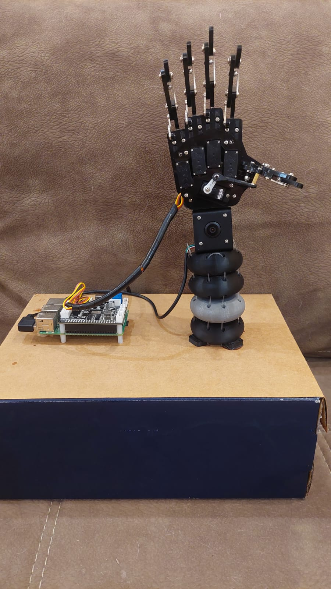
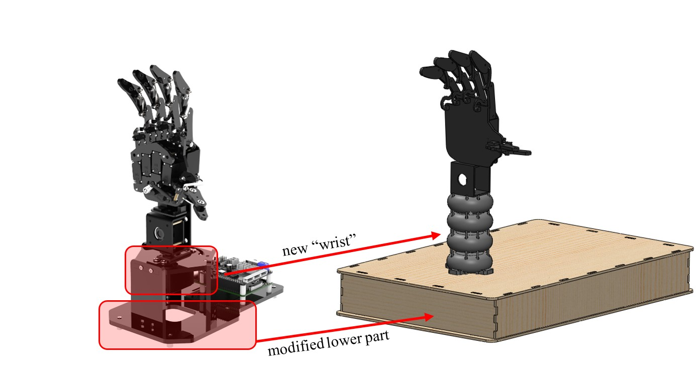
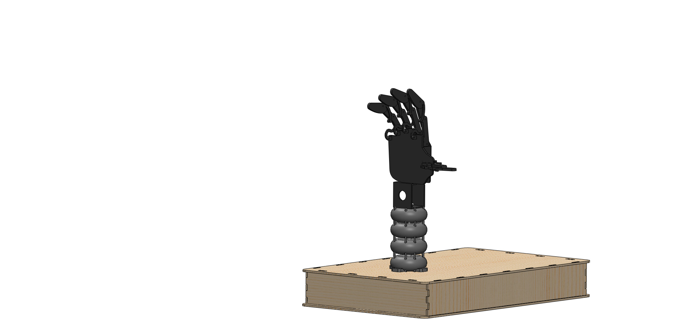
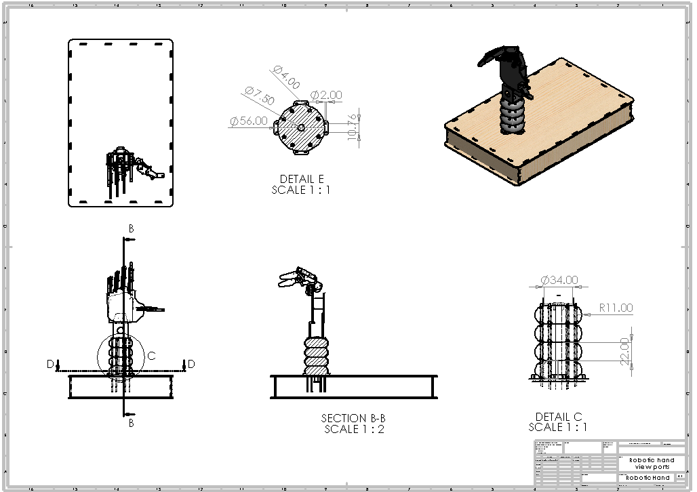

# Sign-Language Educational Robotic Hand
[](https://doi.org/10.5281/zenodo.23102292)

**Bachelor Thesis — Mechanical Engineering, Robotics & Mechatronics**

A physical robotic-hand prototype for sign-language education, developed by extending a commercial **Hiwonder uHandPi** platform with a custom **cable-driven continuum wrist**, mechanical modelling, multibody simulation, 3D printing, Raspberry Pi control and a preliminary vision-based sign-selection interface.

> **Status:** Completed bachelor thesis prototype  
> **Academic year:** 2023–2024  
> **Institution:** National Polytechnic University of Armenia



---

## At a Glance

| | |
|---|---|
| **Problem** | The original robotic-hand platform had limited wrist mobility for reproducing expressive sign-language poses |
| **My main contribution** | Mechanical redesign and physical implementation of a cable-driven continuum wrist |
| **Hardware** | Hiwonder uHandPi, Raspberry Pi 4, servo motors, 3D-printed wrist |
| **Mechanical tools** | SolidWorks, MSC Adams, Ultimaker Cura |
| **Programming** | Python, Raspberry Pi GPIO/PWM, adapted vision-demo code |
| **Manufacturing** | PLA, TPU, tendon/fishing-line actuation, physical assembly |
| **Result** | Working physical prototype with actuated continuum wrist and basic sign-generation / vision proof-of-concept |
| **Not completed** | General sign-language recognition, automatic learner feedback and closed-loop continuum control |

---

# Project Overview

The goal of this bachelor thesis was to investigate how a low-cost physical robotic hand could be adapted into an interactive platform for **sign-language education**.

Rather than designing an entire dexterous hand from scratch, I used the commercially available **Hiwonder uHandPi** robotic hand as a starting platform.

The original hand already provided independently actuated fingers, Raspberry Pi electronics, camera hardware and open-source control software.

My main engineering focus was the mechanical limitation of the original lower manipulator and wrist.

I replaced this section with a **custom cable-driven compliant / continuum wrist**, designed to provide a wider and more natural bending range while maintaining a relatively simple, inexpensive and manufacturable structure.

The complete project covered:

```text
Problem Definition
        ↓
Mechanical Redesign
        ↓
SolidWorks CAD
        ↓
Kinematic / Dynamic Modelling
        ↓
MSC Adams Simulation
        ↓
Material Selection
        ↓
3D Printing
        ↓
Physical Assembly
        ↓
Raspberry Pi / Servo Control
        ↓
Prototype Testing
```

---

# Mechanical Redesign

## Original Platform

The starting point was the **Hiwonder uHandPi Raspberry Pi robotic hand**.

The original platform included:

- five-finger robotic hand
- finger servo actuation
- Raspberry Pi
- camera
- existing Python control software
- computer-vision demonstration software

The hand mechanism itself was retained.

The original lower manipulator and wrist were not well suited to the range of wrist orientations I wanted to investigate for sign-language gestures.

---

## My Redesign

I removed the original lower manipulator and designed a new continuum-style wrist and support structure.



The redesigned system introduced:

- four rounded wrist sections
- a flexible central backbone
- cable / tendon actuation
- two servo motors
- custom support geometry
- a new base / electronics enclosure
- integration with the existing uHandPi hand

The intention was to obtain a compliant bending mechanism rather than relying entirely on discrete revolute joints.

---

# Cable-Driven Continuum Wrist

The wrist consists of four serially arranged sections connected through a compliant central structure.

```text
uHandPi Hand
     │
     ▼
┌───────────┐
│ Section 1 │
├───────────┤
│ Section 2 │
├───────────┤
│ Section 3 │
├───────────┤
│ Section 4 │
└───────────┘
     │
     ▼
Flexible Backbone
     │
     ▼
Tendon Actuation
     │
     ▼
Servo Motors
```

Instead of producing motion through a conventional rigid wrist joint, the mechanism bends through deformation of the compliant structure.

This approach was selected to investigate:

- larger wrist-bending range
- smoother hand orientation changes
- reduced mechanical complexity
- low-cost construction
- additive manufacturing
- tendon-driven actuation

---

## Tendon Actuation

The physical prototype uses multiple cable / tendon runs routed through the continuum wrist.

The design used **eight physical cable runs**, grouped into effective actuation directions.

Fishing line was used as a low-cost tendon material during prototyping.

Two servo motors actuate the tendon system and produce bending of the wrist.

The project did not implement closed-loop tendon-tension control; the prototype was controlled using predefined servo commands.

---

# CAD Design

The complete modified system was modelled and assembled in **SolidWorks**.

My CAD work included the redesigned:

- continuum wrist sections
- flexible-backbone arrangement
- cable-routing geometry
- connection between the wrist and existing hand
- base / electronics enclosure
- complete modified assembly

CAD assembly analysis was used to inspect clearances and identify potential mechanical conflicts before manufacturing.

## Assembly Overview



## Technical Drawing



Native CAD files and neutral geometry exports are available under:

```text
cad/
├── solidworks/
└── exports/
```

The neutral CAD export is provided as a **Parasolid `.x_t`** file.

---

# Kinematic Modelling

The system contains two mechanically different subsystems:

1. the existing articulated fingers
2. the new compliant continuum wrist

These require different modelling approaches.

---

## Finger Kinematics

The uHandPi hand provides five principal finger-flexion variables.

They can be represented conceptually as:

```text
θ1 → Thumb
θ2 → Index
θ3 → Middle
θ4 → Ring
θ5 → Pinky
```

The thesis investigated the finger system using **Denavit-Hartenberg modelling concepts**.

Forward kinematics considers:

```text
Joint Configuration
        ↓
Finger / End-Effector Pose
```

while inverse kinematics considers:

```text
Desired Pose
        ↓
Required Joint Configuration
```

---

## Continuum-Wrist Modelling

The new wrist cannot be represented as simply as a conventional rigid-link wrist.

The analysis therefore considered the relationship between:

```text
Actuation Space
(tendon lengths)
        ↓
Configuration Space
(curvature / orientation)
        ↓
Operational Space
(hand pose)
```

The aim was to understand how changes in tendon actuation influence the configuration of the compliant wrist and therefore the position and orientation of the hand.

---

## Differential Kinematics

Differential kinematics was studied to relate actuator changes to motion of the robotic hand.

Conceptually:

```text
Tendon Velocities
        ↓
Configuration Velocity
        ↓
Jacobian Relationship
        ↓
End-Effector Velocity
```

This modelling provides a foundation for more advanced closed-loop continuum control, although such a controller was not implemented in the bachelor-thesis prototype.

---

# Dynamic Modelling

The thesis also investigated the dynamic behaviour of the mechanism.

The modelling considered factors including:

- component mass
- inertia
- centres of mass
- gravity
- elastic behaviour
- damping
- friction
- motor torque
- compliant-joint behaviour

This allowed the redesign to be considered as a dynamic mechanical system rather than purely as static CAD geometry.

---

# MSC Adams Simulation

The redesigned robotic hand and wrist were simulated using **MSC Adams**.

The multibody model was used to investigate the behaviour of the wrist during motion.

Simulation outputs included quantities such as:

- hand position
- angular position
- angular velocity
- kinetic energy
- deformation / displacement

## Simulation Demonstration

[Watch the MSC Adams wrist simulation](media/demos/adams_wrist_simulation.mp4)

The recovered MSC Adams project files are stored under:

```text
simulation/adams/
```

The simulation was used alongside the CAD design to evaluate the expected mechanical behaviour before and during physical prototyping.

---

# Manufacturing

## 3D Printing

The custom wrist components were prepared for additive manufacturing using **Ultimaker Cura** and printed using a **Creality Ender 3**.

Two materials were used.

### PLA

PLA was used for the rigid continuum-wrist sections.

The complete set of wrist components required more than ten hours of printing.

### TPU

TPU was used for the flexible backbone because its compliance was better suited to the bending mechanism.

The backbone required approximately two hours of printing.

---

# Physical Assembly

The printed components were assembled with:

- rigid PLA wrist sections
- TPU flexible component
- mechanical fasteners
- fishing-line tendons
- servo actuation
- Raspberry Pi electronics
- the retained uHandPi robotic hand

## Final Prototype


The result was a complete physical prototype rather than only a CAD or simulation model.

---

# Wrist Control

The newly designed wrist was controlled separately from the original uHandPi finger-control software.

A **Raspberry Pi 4 Model B** generated PWM commands for two servo motors controlling the tendon mechanism.

The control architecture was:

```text
Python
   │
   ▼
Raspberry Pi GPIO
   │
   ▼
PWM
   │
   ▼
Two Servo Motors
   │
   ▼
Tendon Displacement
   │
   ▼
Continuum-Wrist Bending
```

The bachelor-thesis implementation used predefined servo positions rather than a closed-loop continuum controller.

The original source file for this small wrist-control program has not yet been recovered, but the implementation is documented in the thesis.

The documented program includes:

- Raspberry Pi GPIO configuration
- two servo-control outputs
- 50 Hz PWM
- conversion from requested servo angle to PWM duty cycle
- simultaneous command of both servos
- GPIO cleanup on program termination

If the original source cannot be recovered, a clearly labelled reconstruction may later be added based on the archived thesis implementation.

---

# Finger Control and Vision Prototype

The finger-control and camera system originated from the existing **uHandPi software platform**.

I did **not** develop the complete uHandPi software stack from scratch.

Instead, I adapted parts of the existing software for the sign-language prototype.

---

## Adapted Gesture Detection

The uHandPi software included an existing **rock-paper-scissors / hand-gesture recognition demonstration**.

I modified this existing logic as a proof of concept for selecting sign-language hand configurations.

For the prototype, existing detected gesture classes were repurposed as commands for sign-language gestures, including:

```text
Detected Rock
     ↓
Trigger Letter A configuration
```

and:

```text
Detected Scissors
     ↓
Trigger Letter K configuration
```

This was a **prototype mapping**, not a general-purpose sign-language recognition system.

The purpose was to demonstrate how an existing vision classifier could trigger predefined robotic-hand configurations.

---

# Sign-Language Interaction Concept

The implemented prototype combined predefined hand movements with the educational concept:

```text
Gesture / Sign Selection
        ↓
Robot Hand Configuration
        ↓
Robot Demonstrates Sign
        ↓
Learner Observes / Repeats
```

The longer-term concept was:

```text
Learner Performs Sign
        ↓
Camera Recognition
        ↓
Accuracy Evaluation
        ↓
Automatic Feedback
```

The second pipeline was **not completed** during the bachelor thesis.

---

# Implemented vs Planned

| Component | Status |
|---|---|
| Physical robotic-hand prototype | ✅ Implemented |
| Custom continuum wrist | ✅ Implemented |
| SolidWorks CAD design | ✅ Implemented |
| Technical drawing | ✅ Implemented |
| Kinematic modelling | ✅ Studied / developed |
| Continuum-mechanism modelling | ✅ Studied / developed |
| MSC Adams simulation | ✅ Implemented |
| PLA / TPU manufacturing | ✅ Implemented |
| Physical wrist assembly | ✅ Implemented |
| Two-servo tendon actuation | ✅ Implemented |
| Raspberry Pi wrist-control code | ✅ Implemented |
| Basic physical wrist movement | ✅ Demonstrated |
| Existing uHandPi finger software | ✅ Used as baseline |
| Adapted rock-paper-scissors detector | ✅ Prototype implemented |
| Gesture → predefined sign mapping | ✅ Proof of concept |
| General sign-language recognition | ❌ Not implemented |
| Automatic learner-sign evaluation | ❌ Not implemented |
| Real-time educational feedback | ❌ Not implemented |
| Closed-loop wrist control | ❌ Not implemented |
| Quantitative positioning validation | ❌ Not performed |
| Formal educational user study | ❌ Not performed |

---

# Demonstrations

## Physical Continuum-Wrist Test

[Watch the physical wrist demonstration](media/demos/physical_wrist_demo.mp4)

This video shows the manufactured continuum wrist moving on the physical prototype.

The wrist mechanism was the main mechanical focus of the bachelor thesis.

---

## MSC Adams Simulation

[Watch the MSC Adams simulation](media/demos/adams_wrist_simulation.mp4)

The simulation shows the redesigned wrist mechanism being evaluated in the multibody environment.

---

## Optional Inline GIF

If included in this repository:


---

# Engineering Results

The project successfully produced a physical mechatronics prototype incorporating a custom compliant wrist into an existing robotic-hand platform.

The principal engineering outcomes were:

- redesign of the original lower manipulator
- custom cable-driven continuum wrist
- complete CAD-to-hardware development workflow
- multibody simulation
- PLA / TPU manufacturing
- tendon-based wrist actuation
- Raspberry Pi servo control
- physical demonstration of the continuum mechanism
- integration with the existing uHandPi hand
- preliminary adaptation of existing vision software for sign-selection commands

The project demonstrated the **mechanical and mechatronic feasibility** of the redesign.

It did not establish quantitative sign-recognition accuracy or educational effectiveness.

---

# Engineering Limitations

## Open-Loop Wrist Control

The wrist used predefined servo positions rather than sensing the actual continuum shape or hand pose.

This means effects such as:

- tendon stretch
- friction
- backlash
- hysteresis
- deformation
- servo error

were not actively compensated.

---

## Mechanical Repeatability

Continuum and cable-driven mechanisms can be sensitive to cable tension, material deformation and assembly tolerances.

The prototype did not include a systematic quantitative repeatability study.

---

## Software Integration

The custom wrist controller and the existing uHandPi finger-control software were not fully consolidated into a single clean software architecture.

---

## Vision System

The vision work was limited to adapting existing uHandPi gesture-recognition functionality as a proof of concept.

A dedicated sign-language recognition model was not developed.

---

## Educational Feedback

Automatic comparison between the learner's gesture and the desired sign was not implemented.

No formal study with learners was conducted.

---

# Future Work

Potential future development includes:

- integrate finger and wrist control into one software architecture
- recover or reconstruct the original wrist-control source
- implement closed-loop continuum control
- add tendon-tension or shape sensing
- add hand-pose feedback
- improve tendon calibration
- quantitatively evaluate wrist repeatability
- develop dedicated sign-language recognition
- extend the sign library
- provide automatic learner feedback
- evaluate the system with educators and learners
- improve enclosure and electronics integration
- investigate alternative compliant materials
- optimise the continuum geometry
- add safety and emergency-stop functionality

---

# Technology Stack

## Mechanical Engineering

- SolidWorks
- MSC Adams
- continuum robotics
- tendon / cable-driven mechanisms
- compliant mechanisms
- mechanical prototyping
- engineering drawings

## Manufacturing

- Ultimaker Cura
- Creality Ender 3
- PLA
- TPU
- additive manufacturing

## Embedded / Control

- Raspberry Pi 4
- Python
- RPi.GPIO
- PWM servo control
- servo motors

## Computer Vision

- OpenCV
- adapted uHandPi gesture-recognition pipeline

---

# Repository Structure

```text
sign-language-robotic-hand/
│
├── README.md
│
├── cad/
│   ├── solidworks/
│   │   ├── Robotic Arm.SLDASM
│   │   ├── RoboticHand.SLDDRW
│   │   └── [associated SolidWorks parts]
│   │
│   └── exports/
│       └── robotic_hand_assembly.x_t
│
├── simulation/
│   └── adams/
│       ├── Jessica_Robot.bin
│       └── MODEL_hand.bin
│
├── media/
│   ├── prototype/
│   │   └── final_prototype.jpg
│   │
│   ├── cad/
│   │   ├── assembly_render.jpg
│   │   ├── design_comparison.jpg
│   │   └── technical_drawing.png
│   │
│   └── demos/
│       ├── physical_wrist_demo.mp4
│       ├── adams_wrist_simulation.mp4
│       └── continuum_wrist.gif
│
├── src/
|   ├── wrist_control/
|   │   └── continuum_wrist_control.py
|   ├── vision/
|   │   └── gesture_to_sign_mapping.py
|   └── README.md
└── docs/
```

Not every original project file is included.

Large software installations, Python distributions and third-party uHandPi source trees are intentionally excluded.

---

# Attribution and Third-Party Work

## Hiwonder uHandPi

This project builds upon the commercially available **Hiwonder uHandPi** robotic-hand platform.

The existing platform provided:

- robotic hand and finger mechanism
- finger servos
- Raspberry Pi electronics
- camera
- existing Python control software
- existing OpenCV / vision demonstrations

These components are **not claimed as my original work**.

---

## Vision Software

The recovered `robot.py` originates substantially from the existing uHandPi / Lobot software.

The original source identifies the upstream author as **Aiden** and references the Lobot project.

My work involved modifying and repurposing parts of this existing vision/demo pipeline for the sign-language prototype, including adapting gesture classes to trigger predefined sign-language hand configurations.

The upstream software itself is not claimed as my original implementation.

---

## My Original Thesis Work

My primary original contributions were:

- mechanical redesign of the lower manipulator
- design of the cable-driven continuum wrist
- CAD integration of the redesigned mechanism
- mechanical drawings
- continuum-robot modelling
- kinematic and dynamic analysis
- MSC Adams simulation
- material selection
- additive manufacturing
- physical assembly
- tendon / servo integration
- custom Raspberry Pi control of the continuum wrist
- physical testing of the redesigned mechanism
- adaptation and integration of existing vision functionality into the project concept

---

# What This Project Demonstrates

For robotics and mechatronics roles, this project demonstrates experience with:

- physical robot prototyping
- robotic hands and end-effectors
- continuum robotics
- compliant mechanisms
- tendon-driven actuation
- SolidWorks CAD
- engineering drawings
- multibody dynamics
- MSC Adams
- kinematic modelling
- additive manufacturing
- material selection
- Raspberry Pi
- Python
- PWM servo control
- computer-vision integration
- hardware/software integration
- iterative engineering design
- human-robot interaction concepts
- adapting an existing robotic platform rather than treating third-party work as original

---

# Academic Context

**Bachelor Thesis — 2023/2024**

**Mechanical Engineering — Robotics & Mechatronics Track**  
National Polytechnic University of Armenia

**Author:** Jessica Dichakdjian  
**Supervisor:** Prof. Narek Zakaryan

---

# Project Status

✅ **Completed physical bachelor-thesis prototype**

The core mechanical redesign, modelling, simulation, manufacturing and physical wrist actuation were completed.

The broader educational AI / automatic-feedback system remained incomplete and is presented here as future work rather than as a completed capability.
